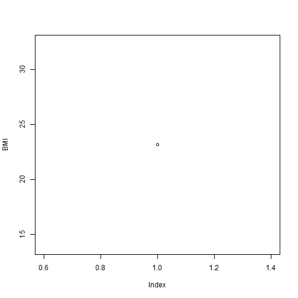

BMI Calculator
========================================================
author: Nirmala
date: 05/23/2015

What is BMI?
========================================================
The Body Mass Index (BMI) is a measure of body fat based on height and weight that applies to adult men and women. Regarding the BMI measure, the World Health Organization (WHO) proposes the following classification:


- BMI <18.5 : Underweight
- BMI [18.5-24.9] : Normal weight
- BMI [25-29.9] : Overweight
- BMI >=30 : Obesity


How is it calculated?
==========================================================

There is a formula for calculating the BMI measure. The formula is the following:

    BMI = weight(kg) / height(metres)$^2$

    Thus for the next example, the BMI will be:


Slide With Code
========================================================


```r
weight=75
height=1.80
BMI<-weight / height^2
BMI
```

```
[1] 23.14815
```

Slide With Plot
========================================================

 

Conclusion
========================================================

The BMI is a relatively easy, cheap and non-invasive method for establishing weight status, and for most people, it correlates reasonably well with their level of body fat.

However, BMI is only a proxy for body fatness. other factors such as fitness, ethnic origin and puberty can alter the relation between BMI and body fatness and must be taken into consideration.
